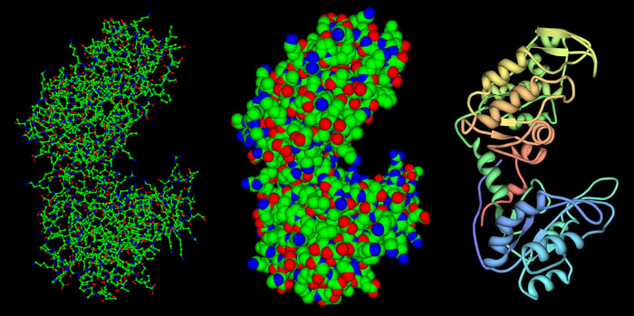
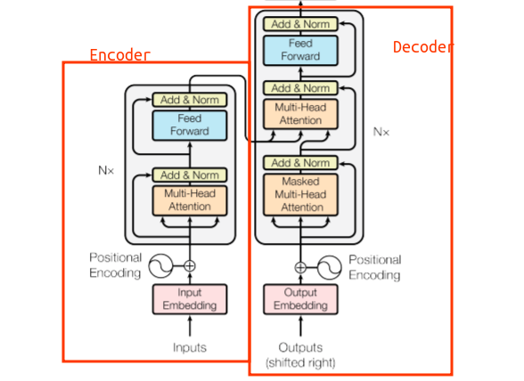

# PFAM classification task

See colab notebook for best viewing experience, [here](https://colab.research.google.com/drive/1xTjo-f9W-_loeyCREzPjTOrLusHUzVIC?usp=sharing).

</img>

## Overview
<p align="center">
    </img>
    <p style='text-align:center;'> Fig. 1: Visualisation of protein sequence and structure </p>
</p>

- Proteins are sequences of amino acids, i.e. "HWLQMRD...".
- The amino acid sequences determine the structure and therefore the function of the protein.
- The [PFAM dataset](https://www.kaggle.com/datasets/googleai/pfam-seed-random-split) is a subset of the UniProt database, which contains protein sequences.
and corresponding meta data, such as family_id, family_name, and sequence. An example entry:
```
sequence: HWLQMRDSMNTYNNMVNRCFATCIRSFQEKKVNAEEMDCTKRCVTKFVGYSQRVALRFAE 
family_accession: PF02953.15
sequence_name: C5K6N5_PERM5/28-87
aligned_sequence: ....HWLQMRDSMNTYNNMVNRCFATCI...........RS.F....QEKKVNAEE.....MDCT....KRCVTKFVGYSQRVALRFAE 
family_id: zf-Tim10_DDP
```
- **The task is to classify protein sequences into their respective PFAM families.**

Tech stack:
- **Python, PyTorch, Transformers, Sequence Models, Large (Protein) Language Models, Huggingface, Pandas, Numpy, Scikit-learn, Matplotlib, Seaborn**

## Approach
1. Exploratory Data Analysis (EDA)
    - Histograms of sequence lengths distribution, 
    - Missing values
    - Class imbalances
    - Key statistics and visualizations
2. Data Preprocessing
    - Tokenization
    - Padding
    - Train-test split
3. Model Definition
    - Transformer model (BERT-style)
4. Training
5. Evaluation: defining key metrics
    - Accuracy
    - F1 score
    - Confusion matrix

<p align="center">
    </img>
    <p style='text-align:center;'> Fig. 2:Transformer model architecture </p>
</p>